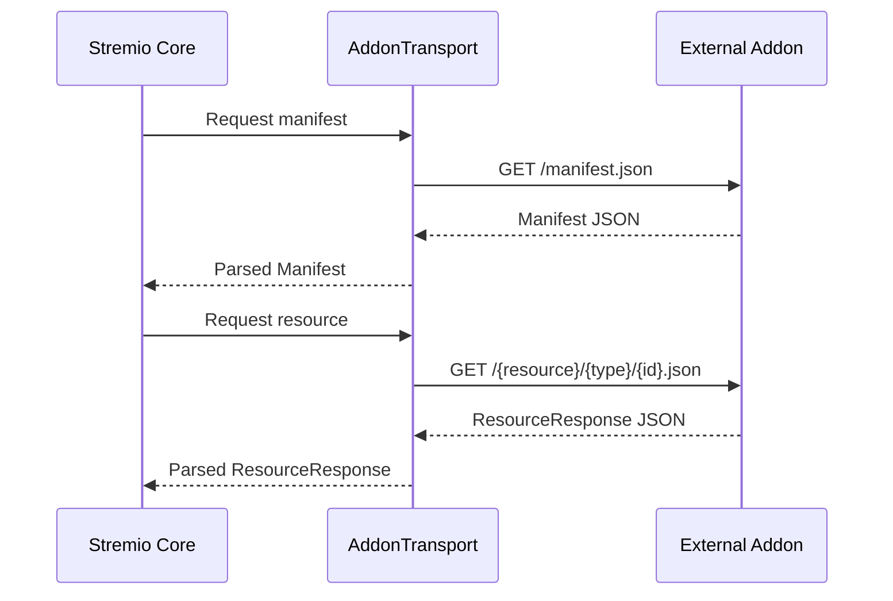

## What are Stremio Addons?

Stremio addons are external services that extend Stremio's functionality by providing additional content sources. They communicate with Stremio Core through a well-defined protocol, delivering metadata, streams, subtitles, and catalogs.

## Key Concepts

### Addon Descriptor

An addon is represented by a `Descriptor` which contains:

- **Manifest**: Defines the addon's capabilities, supported resources, and metadata
- **Transport URL**: The base URL where the addon can be accessed
- **Flags**: Additional metadata like `official` and `protected` status

```rust
pub struct Descriptor {
    pub manifest: Manifest,
    pub transport_url: Url,
    pub flags: DescriptorFlags,
}
```

### Resource Types

Addons can provide four main types of resources:

| Resource | Description | Example Use Case |
|----------|-------------|------------------|
| **catalog** | Lists of content items | Browse movies by genre |
| **meta** | Detailed metadata for items | Get movie details, cast, videos |
| **stream** | Playable video sources | Stream a specific episode |
| **subtitles** | Subtitle tracks | Download subtitles for a movie |

### Resource Path Structure

All addon requests follow a consistent URL pattern:

<CodeGroup>
```text Without Extra
/{resource}/{type}/{id}.json
```

```text With Extra Parameters
/{resource}/{type}/{id}/{extra}.json
```
</CodeGroup>

For example:
- `/catalog/movie/top.json` - Top movies catalog
- `/meta/series/tt0944947.json` - Metadata for a series
- `/stream/movie/tt1254207.json` - Streams for a movie
- `/subtitles/movie/tt1254207.json` - Subtitles for a movie

## Addon Communication Flow



## Transport Layer

Stremio Core uses the `AddonTransport` trait to communicate with addons. The primary implementation is `AddonHTTPTransport`, which handles HTTP requests to addon endpoints.

<Info>
The transport layer automatically handles URL encoding, extra parameter serialization, and response parsing.
</Info>

## Type Safety

All addon interactions are strongly typed in Rust:

- Requests use `ResourceRequest` and `ResourcePath` types
- Responses are parsed into `ResourceResponse` enum variants
- Manifests are validated against the `Manifest` struct

This ensures type safety and prevents runtime errors from malformed data.

## Next Steps

<CardGroup cols={2}>
  <Card title="Manifest Structure" icon="file-code" href="./manifest">
    Learn about manifest fields and configuration
  </Card>
  <Card title="Resources" icon="database" href="./resources">
    Explore resource types and responses
  </Card>
  <Card title="Transport" icon="network-wired" href="./transport">
    Understand the transport layer
  </Card>
  <Card title="Creating Addons" icon="plus" href="./creating-addons">
    Build your first addon
  </Card>
</CardGroup>