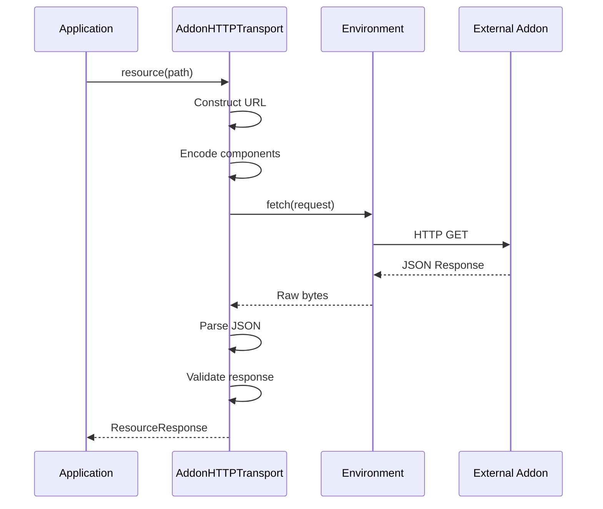

## Overview

The transport layer handles communication between Stremio Core and addons. It abstracts the network protocol and provides a clean interface for requesting resources.

## AddonTransport Trait

The `AddonTransport` trait defines the interface for addon communication:

```rust
pub trait AddonTransport {
    fn resource(&self, path: &ResourcePath) -> TryEnvFuture<ResourceResponse>;
    fn manifest(&self) -> TryEnvFuture<Manifest>;
}
```

### Methods

<ParamField path="resource" type="fn">
  Fetches a resource from the addon.
  
  **Parameters:**
  - `path: &ResourcePath` - The resource path to request
  
  **Returns:** `TryEnvFuture<ResourceResponse>` - Future resolving to the response
</ParamField>

<ParamField path="manifest" type="fn">
  Fetches the addon's manifest.
  
  **Returns:** `TryEnvFuture<Manifest>` - Future resolving to the manifest
</ParamField>

## AddonHTTPTransport

The primary implementation of `AddonTransport` for HTTP-based addons.

### Creating a Transport

```rust
use url::Url;
use stremio_core::addon_transport::AddonHTTPTransport;

let transport_url = Url::parse("https://example.com/manifest.json")?;
let transport = AddonHTTPTransport::<YourEnv>::new(transport_url);
```

<Note>
The transport URL must end with `/manifest.json` for standard addons or `/stremio/v1` for legacy addons.
</Note>

### URL Construction

The transport automatically constructs URLs based on the resource path:

#### Without Extra Parameters

```
Base: https://example.com/manifest.json
Resource Path: ResourcePath {
    resource: "catalog",
    type: "movie",
    id: "top",
    extra: []
}
Result: https://example.com/catalog/movie/top.json
```

#### With Extra Parameters

```
Base: https://example.com/manifest.json
Resource Path: ResourcePath {
    resource: "catalog",
    type: "movie",
    id: "top",
    extra: [("genre", "Action"), ("skip", "100")]
}
Result: https://example.com/catalog/movie/top/genre=Action&skip=100.json
```

### URL Encoding

All URL components are percent-encoded using `URI_COMPONENT_ENCODE_SET`:

```rust
// Resource, type, and id are encoded
format!(
    "/{}/{}/{}.json",
    utf8_percent_encode(&path.resource, URI_COMPONENT_ENCODE_SET),
    utf8_percent_encode(&path.type, URI_COMPONENT_ENCODE_SET),
    utf8_percent_encode(&path.id, URI_COMPONENT_ENCODE_SET),
)
```

Extra parameters are encoded using `query_params_encode()`:

```rust
query_params_encode(path.extra.iter().map(|ev| (&ev.name, &ev.value)))
```

## ResourcePath

Defines the path to a specific resource:

```rust
pub struct ResourcePath {
    pub resource: String,
    pub type: String,
    pub id: String,
    pub extra: Vec<ExtraValue>,
}
```

### Creating ResourcePath

<CodeGroup>
```rust Without Extra
ResourcePath::without_extra("meta", "movie", "tt1254207")
```

```rust With Extra
ResourcePath::with_extra(
    "catalog",
    "movie",
    "top",
    &[ExtraValue {
        name: "genre".into(),
        value: "Action".into(),
    }]
)
```
</CodeGroup>

### Helper Methods

<ParamField path="get_extra_first_value" type="fn">
  Gets the first value for a named extra parameter.
  
  ```rust
  let search_query = path.get_extra_first_value("search");
  ```
</ParamField>

<ParamField path="eq_no_extra" type="fn">
  Compares two paths ignoring extra parameters.
  
  ```rust
  if path1.eq_no_extra(&path2) {
      // Same resource, type, and id
  }
  ```
</ParamField>

## ResourceRequest

Combines a base URL with a resource path:

```rust
pub struct ResourceRequest {
    pub base: Url,
    pub path: ResourcePath,
}
```

### Creating Requests

```rust
let request = ResourceRequest::new(
    Url::parse("https://example.com/manifest.json")?,
    ResourcePath::without_extra("meta", "movie", "tt1254207")
);
```

## Legacy Transport

For addons using the legacy `/stremio/v1` endpoint format, the transport automatically detects and uses `AddonLegacyTransport`:

```rust
// Automatically detects legacy format
let legacy_url = Url::parse("https://example.com/stremio/v1")?;
let transport = AddonHTTPTransport::<Env>::new(legacy_url);
// Uses AddonLegacyTransport internally
```

<Warning>
Legacy addons use a different URL structure and may have different behavior. New addons should use the standard `/manifest.json` format.
</Warning>

## Error Handling

The transport returns errors in the following cases:

- **Invalid Transport URL**: URL doesn't end with `/manifest.json` or `/stremio/v1`
- **Network Errors**: Connection failures, timeouts
- **Parse Errors**: Invalid JSON responses
- **Validation Errors**: Responses that don't match expected schemas

```rust
match transport.manifest().await {
    Ok(manifest) => {
        println!("Addon: {}", manifest.name);
    }
    Err(EnvError::AddonTransport(msg)) => {
        eprintln!("Transport error: {}", msg);
    }
    Err(e) => {
        eprintln!("Other error: {:?}", e);
    }
}
```

## Environment Override

The transport supports environment variable overrides for specific URLs:

### Cinemeta Addons Catalog

You can override the Cinemeta addons catalog URL:

```bash
export CINEMETA_ADDONS_CATALOG_URL="https://custom-catalog.example.com/addon_catalog/all/community.json"
```

This is useful for testing or using custom addon catalogs.

## Request Flow



## Best Practices

<Tip>
**URL Construction**: Always use the transport's built-in URL construction instead of manually building URLs.
</Tip>

<Tip>
**Error Handling**: Handle all error cases, especially network and parsing errors.
</Tip>

<Tip>
**Caching**: The transport doesn't cache responses. Implement caching at a higher level if needed.
</Tip>

<Tip>
**Validation**: The transport validates responses against expected schemas. Ensure your addon returns properly formatted JSON.
</Tip>