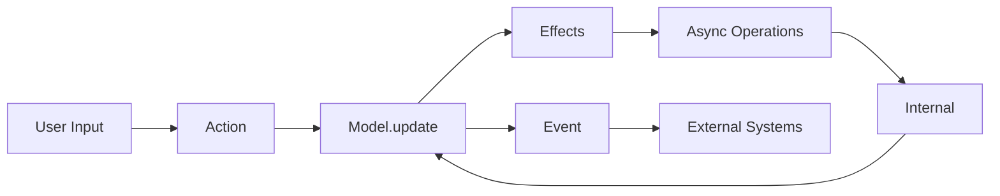

Stremio Core uses a message-driven architecture where all state changes flow through typed messages. There are three main categories of messages: Actions (user inputs), Events (outputs), and Internal messages (core-internal communication).

## Overview

The message system consists of:
- **Msg** - Top-level message enum containing Action, Event, or Internal
- **Action** - Messages dispatched by users of stremio-core
- **Event** - Messages dispatched by stremio-core to be handled externally
- **Internal** - Messages used internally within stremio-core

## Msg

The top-level message type that wraps all message categories.

```rust
pub enum Msg {
    Action(Action),
    Internal(Internal),
    Event(Event),
}
```

### Variants

- `Action` - User-initiated actions
- `Internal` - Internal core messages (async results, state changes)
- `Event` - Events emitted to external systems (analytics, UI updates)

## Action

Actions represent user inputs and requests to modify state or trigger operations.

```rust
pub enum Action {
    Ctx(ActionCtx),
    Link(ActionLink),
    CatalogWithFilters(ActionCatalogWithFilters),
    CatalogsWithExtra(ActionCatalogsWithExtra),
    LibraryByType(ActionLibraryByType),
    LibraryWithFilters(ActionLibraryWithFilters),
    MetaDetails(ActionMetaDetails),
    StreamingServer(ActionStreamingServer),
    Player(ActionPlayer),
    Load(ActionLoad),
    Search(ActionSearch),
    Unload,
}
```

### ActionCtx

Actions related to the global context (authentication, profile, addons, library).

```rust
pub enum ActionCtx {
    Authenticate(AuthRequest),
    Logout,
    DeleteAccount(Password),
    InstallAddon(Descriptor),
    InstallTraktAddon,
    LogoutTrakt,
    UpgradeAddon(Descriptor),
    UninstallAddon(Descriptor),
    UpdateSettings(ProfileSettings),
    AddToLibrary(MetaItemPreview),
    RemoveFromLibrary(String),
    RewindLibraryItem(String),
    LibraryItemMarkAsWatched { id: LibraryItemId, is_watched: bool },
    ToggleLibraryItemNotifications(LibraryItemId, bool),
    DismissNotificationItem(MetaItemId),
    ClearSearchHistory,
    PushUserToAPI,
    PullUserFromAPI { token: Option<AuthKey> },
    PushAddonsToAPI,
    PullAddonsFromAPI,
    SyncLibraryWithAPI,
    PullNotifications,
    GetEvents,
    DismissEvent(String),
    AddServerUrl(Url),
    DeleteServerUrl(Url),
}
```

**Example:**
```rust
// Authenticate user
Action::Ctx(ActionCtx::Authenticate(AuthRequest {
    type_: AuthType::Login,
    email: "user@example.com".to_string(),
    password: "password".to_string(),
}))

// Add item to library
Action::Ctx(ActionCtx::AddToLibrary(meta_item_preview))
```

### ActionPlayer

Actions related to video playback.

```rust
pub enum ActionPlayer {
    VideoParamsChanged { video_params: Option<VideoParams> },
    StreamStateChanged { state: StreamItemState },
    Seek { time: u64, duration: u64, device: String },
    TimeChanged { time: u64, duration: u64, device: String },
    PausedChanged { paused: bool },
    NextVideo,
    Ended,
    MarkVideoAsWatched(Video, bool),
    MarkSeasonAsWatched(u32, bool),
}
```

**Example:**
```rust
// Update playback position
Action::Player(ActionPlayer::TimeChanged {
    time: 12000, // 12 seconds
    duration: 360000, // 6 minutes
    device: "web".to_string(),
})

// Video ended
Action::Player(ActionPlayer::Ended)
```

### ActionMetaDetails

Actions for the meta details screen.

```rust
pub enum ActionMetaDetails {
    MarkAsWatched(bool),
    MarkVideoAsWatched(Video, bool),
    MarkSeasonAsWatched(u32, bool),
    Rate(Option<Rating>),
}
```

**Example:**
```rust
// Mark entire series as watched
Action::MetaDetails(ActionMetaDetails::MarkAsWatched(true))

// Rate a movie
Action::MetaDetails(ActionMetaDetails::Rate(Some(Rating::Thumbs(true))))
```

### ActionLoad

Actions to load specific models/screens.

```rust
pub enum ActionLoad {
    AddonDetails(AddonDetailsSelected),
    CatalogWithFilters(Option<CatalogWithFiltersSelected>),
    CatalogsWithExtra(CatalogsWithExtraSelected),
    DataExport,
    InstalledAddonsWithFilters(InstalledAddonsWithFiltersSelected),
    LibraryWithFilters(LibraryWithFiltersSelected),
    LibraryByType(LibraryByTypeSelected),
    Calendar(Option<CalendarSelected>),
    LocalSearch,
    MetaDetails(MetaDetailsSelected),
    Player(Box<PlayerSelected>),
    Link,
}
```

**Example:**
```rust
// Load meta details for a movie
Action::Load(ActionLoad::MetaDetails(MetaDetailsSelected {
    meta_path: MetaItemPreview {
        id: "tt1234567".to_string(),
        type_: "movie".to_string(),
        ...
    },
}))
```

### ActionStreamingServer

Actions for streaming server operations.

```rust
pub enum ActionStreamingServer {
    Reload,
    UpdateSettings(StreamingServerSettings),
    CreateTorrent(CreateTorrentArgs),
    GetStatistics(StreamingServerStatisticsRequest),
    PlayOnDevice(PlayOnDeviceArgs),
}
```

### ActionCatalogWithFilters

Actions for catalog browsing.

```rust
pub enum ActionCatalogWithFilters {
    LoadNextPage,
}
```

### ActionSearch

Actions for search functionality.

```rust
pub enum ActionSearch {
    Search { search_query: String, max_results: usize },
}
```

**Example:**
```rust
Action::Search(ActionSearch::Search {
    search_query: "game of thrones".to_string(),
    max_results: 20,
})
```

## Event

Events are emitted by stremio-core to notify external systems of state changes and important occurrences.

```rust
pub enum Event {
    // Player events
    PlayerPlaying { context: PlayerAnalyticsContext, load_time: i64 },
    PlayerStopped { context: PlayerAnalyticsContext },
    PlayerNextVideo { context: PlayerAnalyticsContext, is_binge_enabled: bool, is_playing_next_video: bool },
    PlayerEnded { context: PlayerAnalyticsContext, is_binge_enabled: bool, is_playing_next_video: bool },
    
    // Trakt events
    TraktPlaying { context: PlayerAnalyticsContext },
    TraktPaused { context: PlayerAnalyticsContext },
    
    // Storage events
    ProfilePushedToStorage { uid: UID },
    LibraryItemsPushedToStorage { ids: Vec<String> },
    StreamsPushedToStorage { uid: UID },
    SearchHistoryPushedToStorage { uid: UID },
    NotificationsPushedToStorage { ids: Vec<String> },
    DismissedEventsPushedToStorage { uid: UID },
    
    // API events
    UserPulledFromAPI { uid: UID },
    UserPushedToAPI { uid: UID },
    AddonsPulledFromAPI { transport_urls: Vec<Url> },
    AddonsPushedToAPI { transport_urls: Vec<Url> },
    LibrarySyncWithAPIPlanned { uid: UID, plan: (Vec<String>, Vec<String>) },
    LibraryItemsPushedToAPI { ids: Vec<String> },
    LibraryItemsPulledFromAPI { ids: Vec<String> },
    
    // Auth events
    UserAuthenticated { auth_request: AuthRequest },
    UserAddonsLocked { addons_locked: bool },
    UserLibraryMissing { library_missing: bool },
    UserLoggedOut { uid: UID },
    UserAccountDeleted { uid: UID },
    SessionDeleted { auth_key: AuthKey },
    
    // Addon events
    TraktAddonFetched { uid: UID },
    TraktLoggedOut { uid: UID },
    AddonInstalled { transport_url: Url, id: String },
    AddonUpgraded { transport_url: Url, id: String },
    AddonUninstalled { transport_url: Url, id: String },
    
    // Settings and library events
    SettingsUpdated { settings: Settings },
    LibraryItemAdded { id: LibraryItemId },
    LibraryItemRemoved { id: LibraryItemId },
    LibraryItemRewinded { id: LibraryItemId },
    LibraryItemNotificationsToggled { id: LibraryItemId },
    LibraryItemMarkedAsWatched { id: LibraryItemId, is_watched: bool },
    MetaItemRated { id: MetaItemId },
    NotificationsDismissed { id: LibraryItemId },
    
    // Streaming server events
    MagnetParsed { magnet: Url },
    TorrentParsed { torrent: Vec<u8> },
    PlayingOnDevice { device: String },
    StreamingServerUrlsBucketChanged { uid: UID },
    StreamingServerUrlsPushedToStorage { uid: UID },
    
    // Error events
    Error { error: CtxError, source: Box<Event> },
}
```

**Usage:**
```rust
// Listen for events from the runtime
while let Some(RuntimeEvent::CoreEvent(event)) = rx.next().await {
    match event {
        Event::UserAuthenticated { auth_request } => {
            println!("User logged in: {}", auth_request.email);
            // Send analytics
        },
        Event::PlayerPlaying { context, load_time } => {
            println!("Playing: {} (loaded in {}ms)", context.title, load_time);
            // Update UI
        },
        Event::LibraryItemAdded { id } => {
            println!("Added to library: {:?}", id);
            // Show notification
        },
        _ => {}
    }
}
```

## Internal

Internal messages are used within stremio-core for async operation results and internal state coordination.

```rust
pub enum Internal {
    // Auth results
    CtxAuthResult(AuthRequest, Result<CtxAuthResponse, CtxError>),
    UserAPIResult { request: APIRequest, result: Result<User, CtxError>, overwritten: bool },
    DeleteAccountAPIResult(APIRequest, Result<SuccessResponse, CtxError>),
    
    // Addon results
    AddonsAPIResult(APIRequest, Result<Vec<Descriptor>, CtxError>),
    ResourceRequestResult(ResourceRequest, Box<Result<ResourceResponse, EnvError>>),
    ManifestRequestResult(Url, Result<Manifest, EnvError>),
    
    // Library results
    LibrarySyncPlanResult(DatastoreRequest, Result<LibraryPlanResponse, CtxError>),
    LibraryPullResult(DatastoreRequest, Result<Vec<LibraryItem>, CtxError>),
    UpdateLibraryItem(LibraryItem),
    
    // Notifications
    NotificationsRequestResult(ResourceRequest, Box<Result<ResourceResponse, EnvError>>),
    PullNotifications,
    DismissNotificationItem(LibraryItemId),
    
    // State change notifications
    ProfileChanged,
    LibraryChanged(bool), // bool indicates if already persisted
    StreamsChanged(bool),
    SearchHistoryChanged,
    StreamingServerUrlsBucketChanged,
    NotificationsChanged,
    DismissedEventsChanged,
    
    // Internal actions
    Logout(bool), // bool indicates if session was deleted server-side
    InstallTraktAddon,
    InstallAddon(Descriptor),
    UninstallAddon(Descriptor),
    UninstallTraktAddon,
    
    // Player internal
    StreamLoaded { stream: Stream, stream_request: Option<ResourceRequest>, meta_item: ResourceLoadable<MetaItem> },
    StreamStateChanged { state: StreamItemState, stream_request: Option<ResourceRequest>, meta_request: Option<ResourceRequest> },
    
    // Search
    CatalogsWithExtraSearch { query: String },
    LoadLocalSearchResult(Url, Result<Vec<Searchable>, EnvError>),
    
    // Streaming server results
    StreamingServerSettingsResult(Url, Result<SettingsResponse, EnvError>),
    StreamingServerBaseURLResult(Url, Result<Url, EnvError>),
    StreamingServerPlaybackDevicesResult(Url, Result<Vec<PlaybackDevice>, EnvError>),
    StreamingServerNetworkInfoResult(Url, Result<NetworkInfo, EnvError>),
    StreamingServerDeviceInfoResult(Url, Result<DeviceInfo, EnvError>),
    StreamingServerUpdateSettingsResult(Url, Result<(), EnvError>),
    StreamingServerCreateTorrentResult(InfoHash, Result<(), EnvError>),
    StreamingServerPlayOnDeviceResult(String, Result<(), EnvError>),
    StreamingServerGetHTTPSResult(Url, Result<GetHTTPSResponse, EnvError>),
    StreamingServerStatisticsResult((Url, StatisticsRequest), Result<Option<Statistics>, EnvError>),
    
    // Other
    LinkCodeResult(Result<LinkCodeResponse, LinkError>),
    LinkDataResult(String, Result<LinkDataResponse, LinkError>),
    DataExportResult(AuthKey, Result<DataExportResponse, CtxError>),
    SeekLogsResult(SeekLogRequest, Result<SuccessResponse, CtxError>),
    SkipGapsResult(SkipGapsRequest, Result<SkipGapsResponse, CtxError>),
    GetModalResult(APIRequest, Result<Option<GetModalResponse>, CtxError>),
    GetNotificationResult(APIRequest, Result<Option<GetNotificationResponse>, CtxError>),
    RatingGetStatusResult(MetaItemId, Result<RatingGetStatusResponse, EnvError>),
    RatingSendResult(MetaItemId, Result<RatingSendResponse, EnvError>),
}
```

**Note:** Internal messages are typically not dispatched by users of stremio-core. They are produced by effects and handled by models internally.

## Message Flow



1. User dispatches an **Action**
2. Model processes the action in `update()`
3. Model returns **Effects**
4. Runtime executes effects asynchronously
5. Effects produce **Internal** messages with results
6. Model processes internal messages
7. Model emits **Events** for external systems

## Best Practices

<AccordionGroup>
  <Accordion title="Use appropriate message types">
    - **Action**: User inputs, requests from external code
    - **Event**: Notifications to external systems, analytics
    - **Internal**: Async results, internal state coordination
  </Accordion>
  
  <Accordion title="Always handle async results">
    Every async effect should produce an Internal message with the result, which the model must handle.
  </Accordion>
  
  <Accordion title="Emit events for important state changes">
    Use Events to notify external systems of important occurrences like authentication, library changes, playback events.
  </Accordion>
  
  <Accordion title="Keep messages serializable (Actions)">
    Action messages are deserializable from JSON, making them easy to dispatch from different environments (JS, native, etc.).
  </Accordion>
</AccordionGroup>

## See Also

- [Runtime](/api/runtime/runtime) - Runtime that processes messages
- [Effects](/api/runtime/effects) - Effects produced by message handling
- [Env](/api/runtime/env) - Environment for executing effects
