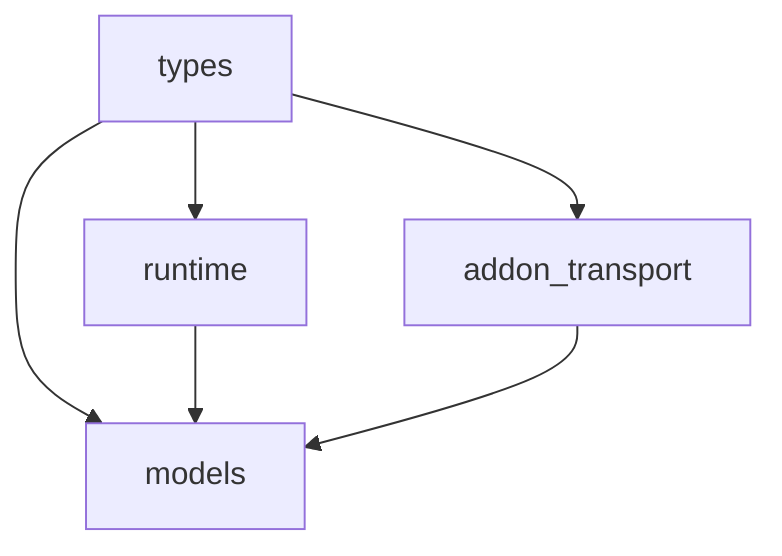

Stremio Core is organized into four main modules that work together to provide a clean, maintainable architecture.

## Module Overview

The library is structured around these core modules:

```rust
pub mod addon_transport;
pub mod models;
pub mod runtime;
pub mod types;
```

### Types Module

The `types` module contains all data structures and type definitions used throughout the library:

- **addon**: Addon manifests, descriptors, and resource definitions
- **api**: API requests and responses for backend communication
- **library**: Library items and metadata
- **profile**: User profiles, authentication, and settings
- **resource**: Meta items, videos, and content resources
- **streaming_server**: Streaming server types and settings
- **streams**: Stream items and buckets

These types are pure data structures with minimal logic, making them easy to serialize and share across different parts of the application.

### Addon Transport Module

The `addon_transport` module provides an abstraction layer for communicating with Stremio addons:

```rust
pub trait AddonTransport {
    fn resource(&self, path: &ResourcePath) -> TryEnvFuture<ResourceResponse>;
    fn manifest(&self) -> TryEnvFuture<Manifest>;
}
```

Implementations include:

- **AddonHTTPTransport**: Handles HTTP/HTTPS addon communication
- **UnsupportedTransport**: Fallback for unsupported protocols

This abstraction allows Stremio to communicate with addons over different protocols without changing the core logic.

### Runtime Module

The runtime module implements the Elm Architecture pattern and provides the execution environment:

- **Runtime**: Manages state and effect execution (see [Elm Architecture](/concepts/elm-architecture))
- **Env trait**: Platform abstraction for I/O operations (see [Effects and Runtime](/concepts/effects-and-runtime))
- **Msg system**: Message-based communication between components
- **Effects**: Asynchronous operations and state updates

### Models Module

The models module contains all stateful application logic:

- **ctx**: Core application context including user profile and library
- **catalog_with_filters**: Catalog browsing with filtering
- **meta_details**: Detailed metadata for content items
- **player**: Video player state and logic
- **streaming_server**: Streaming server management
- **library_with_filters**: Library browsing and filtering

Each model is a self-contained state machine that responds to messages and produces effects. See [Models and State](/concepts/models-and-state) for details.

## Design Principles

<CardGroup cols={2}>
  <Card title="Separation of Concerns" icon="layer-group">
    Each module has a clear responsibility: types for data, transport for communication, runtime for execution, and models for business logic.
  </Card>
  <Card title="Platform Independence" icon="globe">
    The Env trait abstracts platform-specific operations, allowing the core to run on desktop, mobile, and web.
  </Card>
  <Card title="Testability" icon="flask">
    Pure functions and message-based communication make the code highly testable without mocking.
  </Card>
  <Card title="Type Safety" icon="shield">
    Rust's type system prevents entire classes of bugs at compile time.
  </Card>
</CardGroup>

## Module Dependencies



The `types` module is the foundation, with all other modules depending on it. The `runtime` provides the execution environment for `models`, which use `addon_transport` to communicate with addons.

## Next Steps

<CardGroup cols={2}>
  <Card title="Elm Architecture" icon="arrows-rotate" href="/concepts/elm-architecture">
    Learn about the Effect, Update, and Msg pattern
  </Card>
  <Card title="Models and State" icon="database" href="/concepts/models-and-state">
    Understand how stateful models work
  </Card>
  <Card title="Effects and Runtime" icon="play" href="/concepts/effects-and-runtime">
    Explore the runtime and effect handling
  </Card>
</CardGroup>